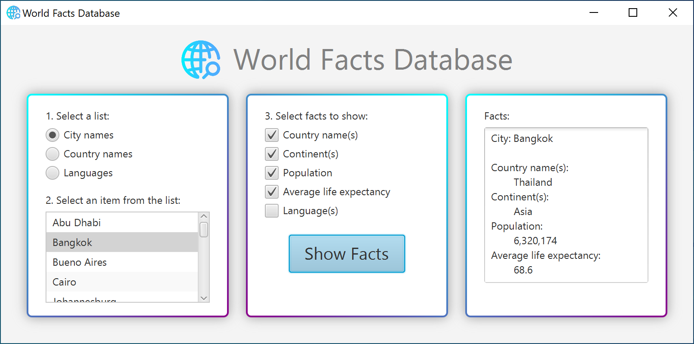

# world_database_gui_java

This Java program creates a clean, visually appealing JavaFX GUI to retrieve and display data from a sample database of world facts (WorldDB). Implements multi-threading to create/execute SQL queries and update visual control elements in the main JavaFX application when certain click events are triggered. Multi-threading is implemented via nested/inner classes, Task<V>, and Runnable interfaces.
  
**Disclaimer:** WorldDB is a relational database containing sample world facts info that may not be 100% accurate. It is used only for demonstration purposes to show how the JavaFX GUI interacts with a database, and should NOT be used as a real factual reference.

### Other program/project notes:

This Java program was created on **Eclipse IDE** using **JDK 1.8.0_271**.

WorldDB is an Apache Derby database. To access and use it locally: 
1. Add the entire **WorldDB** folder (can be downloaded from this repository) to your local project folder and modify the database URL string if needed. 
2. Add **derby.jar** (can be downloaded from this repository) to the JRE system library in the project build path. To do this, you may need to configure the project build path and add derby.jar as an external JAR.

## Don't want to download files or configure your system to see how this program works?

Here's a screenshot of the application: 

When the user clicks on a radio button, the ListView control is updated with the corresponding list of city names, country names, or languages. The user can then select an item from the list. To display specific facts about the chosen list item, the user can click on one or more checkboxes and then click the "Show Facts" button. Selected facts will then display in the TextArea control.
